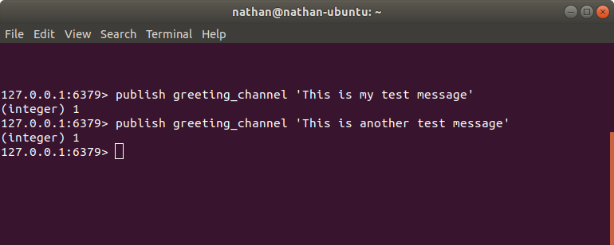
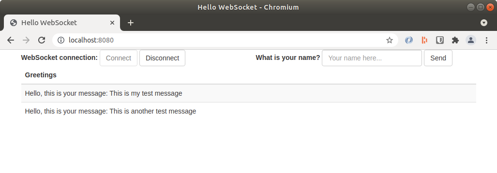

# Websockets Pub/Sub Demo

This project is a demonstration of a Spring Boot application that listens to a Redis Pub/Sub channel and pushes messages to web clients via WebSockets. This serves as a practical example for developers looking to implement real-time messaging in their applications, allowing multiple web clients to receive updates as events are published to a Redis server.

## Project Description

Redis Pub/Sub is a messaging paradigm where publishers send messages to channels, and subscribers receive them. This project leverages this feature to broadcast messages from a Redis channel to multiple web clients in real-time. A message published from the `redis-cli` to a specific channel will be displayed on all connected web clients. This architecture allows for scalable real-time communication, as multiple application instances can publish messages to numerous clients.

## Architecture Overview

The application is built with the following key components:

- **Spring Boot:** Provides the core framework for the application, simplifying the setup and development process.
- **Spring WebSocket:** Enables real-time, two-way communication between the server and clients using the WebSocket protocol.
- **STOMP (Simple Text Oriented Messaging Protocol):** Used over WebSocket to provide a higher-level messaging protocol.
- **Redis:** Acts as the message broker, handling the publishing and subscribing of messages through its Pub/Sub feature.
- **Jedis:** A Java client for Redis.
- **SockJS & stomp.js:** Frontend libraries to enable WebSocket communication in the browser.
- **Maven:** For project build and dependency management.

## How It Works

1.  A web client connects to the Spring Boot application's WebSocket endpoint.
2.  The Spring Boot application subscribes to a Redis channel (`greeging_channel`).
3.  A message is published to the Redis channel (e.g., using `redis-cli`).
4.  The Spring Boot application receives the message from the Redis channel.
5.  The application then broadcasts the message to all connected WebSocket clients.
6.  The web clients receive the message and display it in the browser.

## Prerequisites

Before you can run the application, you need to have the following installed:

-   **Java 11+:** The application is built with Java 11.
-   **Redis:** A Redis server must be running on `localhost:6379`.

## Getting Started

### 1. Clone the Repository

```bash
git clone https://github.com/nathan-standafer/websockets-pubsub-demo.git
cd websockets-pubsub-demo
```

### 2. Run the Application

You can run the Spring Boot application using the Maven wrapper:

**On Linux/macOS:**

```bash
./mvnw spring-boot:run
```

**On Windows:**

```bash
mvnw.cmd spring-boot:run
```

The application will start on `http://localhost:8080`.

### 3. Connect the Web Client

Open your web browser and navigate to `http://localhost:8080`. Click the **"Connect"** button to establish a WebSocket connection.

### 4. Publish Messages from Redis

Open a terminal and use the `redis-cli` to publish messages to the `greeging_channel` channel:

```bash
redis-cli
```

Once in the Redis CLI, publish a message:

```bash
PUBLISH greeging_channel "Hello, from Redis!"
```



### 5. View the Messages

You should see the message appear in your web browser in real-time.



## Contributing

Contributions are welcome! If you find any issues or have suggestions for improvements, please open an issue or submit a pull request.